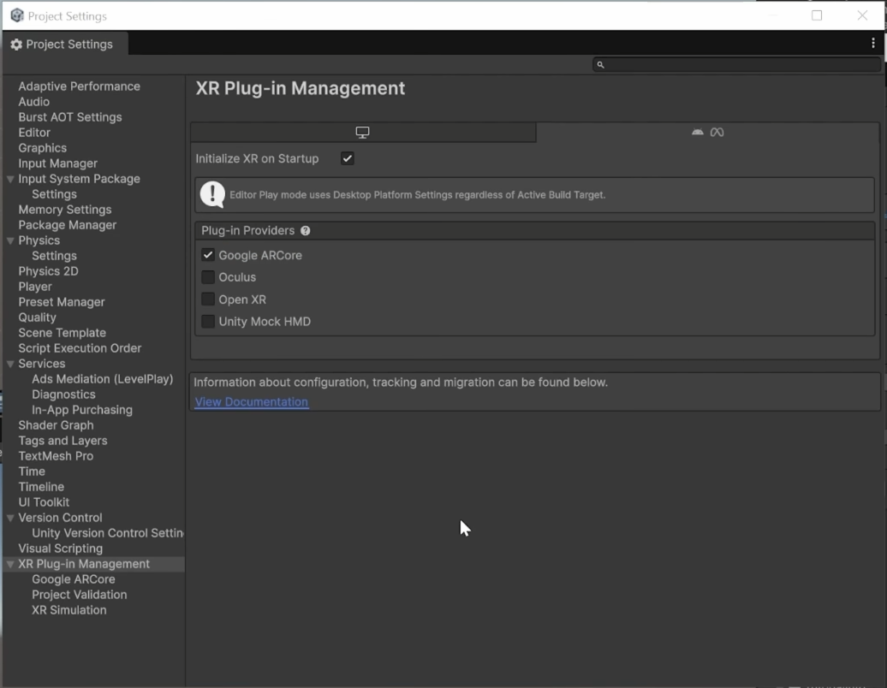
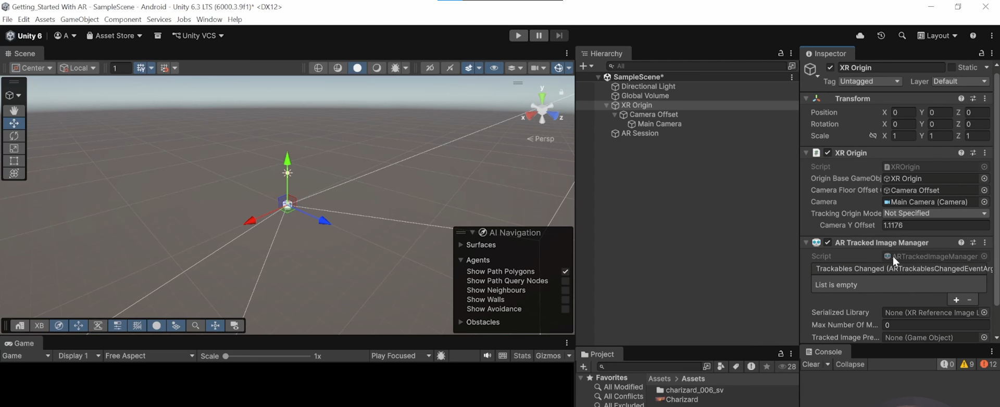
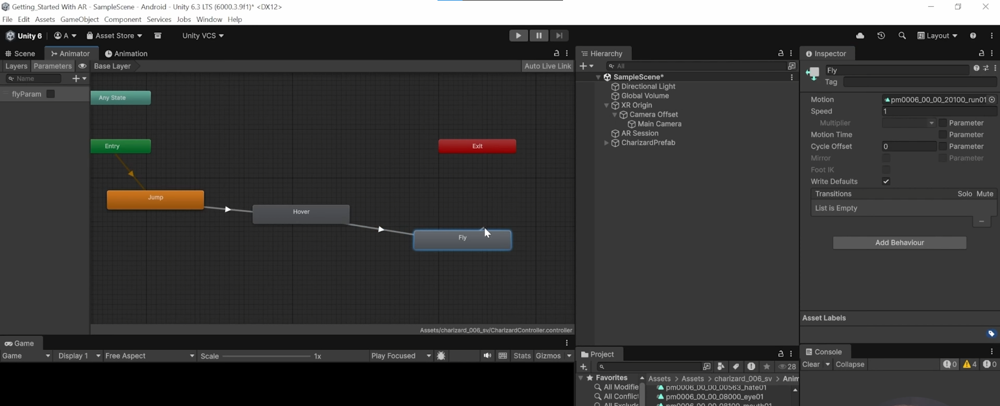
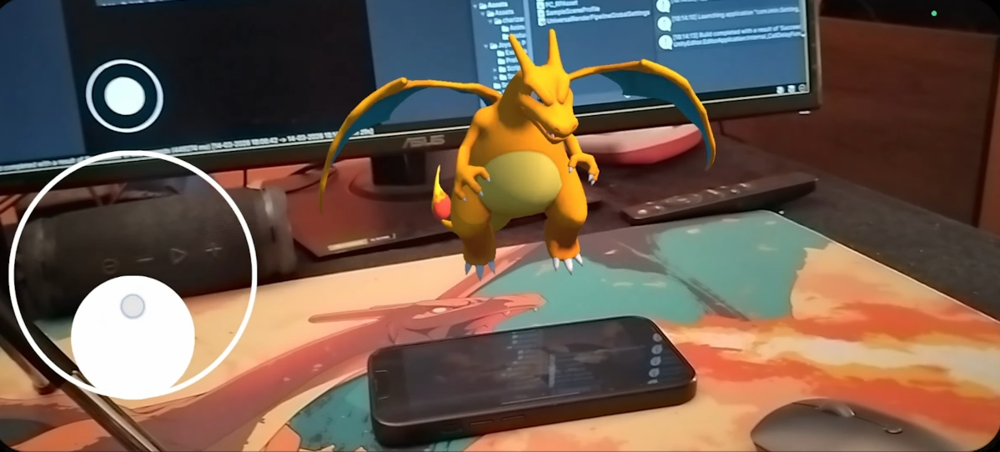

# 📱 Практическое задание: Разработка AR-приложения


> **Краткое описание:** Проект представляет собой приложение дополненной реальности (AR) для Android. Основной функционал — распознавание 2D-маркеров (изображений) в реальном времени и проекция на них интерактивных 3D-моделей с возможностью управления через экранный джойстик.

---

## 📑 Оглавление
1. [Структура проекта](#-структура-проекта)
2. [Используемые технологии](#-используемые-технологии)
3. [Архитектура и паттерны](#-архитектура-и-паттерны)
4. [Этапы разработки](#-этапы-разработки)
5. [Сборка и тестирование](#-сборка-и-тестирование)

---

## 📂 Структура проекта

Для поддержания порядка в репозитории используется строгая иерархия папок:

```text
📦 Assets
 ┣ 📂 Animations       # Контроллер анимаций и состояния (Jump, Hover, Fly)
 ┣ 📂 Prefabs          # Готовые префабы (Charizard, Fixed Joystick)
 ┣ 📂 Scripts          # C#-скрипты с логикой приложения
 ┃ ┣ 📜 ARTrackedImageSpawner.cs
 ┃ ┗ 📜 CharizardController.cs
 ┣ 📂 XR               # Библиотека эталонных изображений (Reference Image Library)
 ┗ 📜 MainScene.unity  # Основная сцена с XR Origin
```

---

## 🛠 Используемые технологии

| Компонент / Модуль | Назначение в проекте |
| :--- | :--- |
| **Unity Editor (LTS)** | Основная среда разработки, сборка под ARM64 / IL2CPP. |
| **AR Foundation** | Базовый фреймворк Unity для работы с дополненной реальностью. |
| **Google ARCore XR Plugin** | Провайдер машинного зрения и трекинга для платформы Android. |
| **com.unity.cloud.gltfast** | Пакет для импорта и обработки 3D-моделей формата `.gltf`. |

---

## 🏗 Архитектура и паттерны

Разработка ведется в рамках ECS-подобной парадигмы Unity. Особое внимание уделено **принципу единственной ответственности (SRP из SOLID)**. 

Логика строго декомпозирована на два независимых скрипта:
1. `ARTrackedImageSpawner.cs` — отвечает *только* за обработку событий AR-сессии и спавн объекта при обнаружении маркера.
2. `CharizardController.cs` — отвечает *только* за обработку ввода пользователя и физику.

**Пример реализации контроллера управления (фрагмент):**
```csharp
using UnityEngine;

[RequireComponent(typeof(Rigidbody), typeof(Animator))]
public class CharizardController : MonoBehaviour
{
    [SerializeField] private float speed = 0.2f;
    private FixedJoystick joystick;
    private Rigidbody rb;
    private Animator animator;

    void OnEnable()
    {
        rb = GetComponent<Rigidbody>();
        animator = GetComponent<Animator>();
        joystick = FindFirstObjectByType<FixedJoystick>();
    }

    void FixedUpdate()
    {
        Vector3 movement = new Vector3(joystick.Horizontal, 0, joystick.Vertical);
        rb.velocity = movement * speed;

        if (movement != Vector3.zero)
        {
            transform.rotation = Quaternion.LookRotation(movement);
            animator.SetBool("fly_param", true);
        }
        else
        {
            animator.SetBool("fly_param", false);
        }
    }
}
```

---

## 🚀 Этапы разработки

### 1. Настройка окружения
Скорректированы параметры `Player Settings`: отключен Vulkan API, деактивирован Multi-threaded Rendering. В `XR Plug-in Management` активирован Google ARCore.


*Рис. 1: Инициализация ARCore в качестве основного провайдера.*

### 2. Подготовка AR-сцены
Стандартная камера заменена на **XR Origin (Mobile AR)**. Добавлен `AR Session` для контроля жизненного цикла приложения. За трекинг маркеров отвечает компонент `AR Tracked Image Manager`.


*Рис. 2: Иерархия объектов для работы с дополненной реальностью.*

### 3. Настройка конечного автомата (Animator)
Создан `Animator Controller` с тремя ключевыми состояниями: *Jump* (инициализация), *Hover* (покой) и *Fly* (передвижение). Логика переходов управляется параметром `fly_param`.


*Рис. 3: Граф состояний анимаций.*

---

## 📱 Сборка и тестирование

Для рендеринга камеры реального мира на задний фон сцены был подключен профиль `AR Background Renderer Feature`. Финальная компиляция (`Build and Run`) успешно произведена на Android-устройство через USB Debugging.


*Рис. 4: Финальный результат — 3D-модель успешно спроецирована на реальный маркер.*
